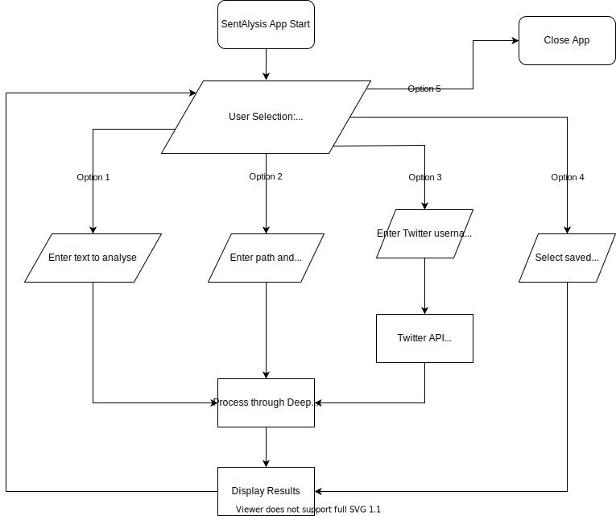

# SentAlysis

## Sentiment analysis of any text, text file or latest tweets for any Twitter user, hashtag or search term

Analysing text to infer the sentiment behind it can be a useful tool that is used in many industries including politics, finance and medicine to provide valuable insight to make informed business decisions. SentAlysis was designed and built to provide sentiment analysis through Deep AI of text that is input directly by the user, provided in a text file or by searching Twitter for a particular user or search term.

Sentalysis requires a text input to anylse, which can be provided by the user in a few different ways:

- User types text directly into the app.
- User provides a text file to analyse.
- User specifies a username or term to search on Twitter using the Twitter API.

Once the input is provided or retrieved, Sentalysis collates the data and sends it to the Deep AI Semantic Analysis API for analysis. The results are then gathered and displayed to the user.

### Jump To Section

- [App Structure](#app-structure)
- [Dependencies](#dependencies)
- [Flowchart](#flowchart)

### App Structure

Twitter Class

- get_tweets method

    Send request to Twitter API to retrieve tweets.
  
    input: search term or Twitter username provided by user, max results to retrieve

    output: dictionary of the retrieved tweets

- parse_tweets method

    Retrieved tweets are parsed and just the text content is concatenated into a single string which is returned.

    input: dictionary of the tweets retrieved by the Twitter API

    output: The text content of every tweet concatenated into a single string

Analysis Class

- analyse_text method

    Send text to Deep AI to analyse and return as a list of strings for each phrase analysed.

    input: text provided by user or data received from Twitter API

    output: list of strings provided by Deep AI API

- collate_data method

    Take list provided by Deep AI and collate data into total phrases, totals of each response from Deep AI and return dictionary of values.

    input: list provided by analyse_text method

    output: dictionary of collated data

- view_report method

    Using the data which has been retrieved and collated, generate and display a report for the user to see.

    input: dictionary of collated data

    output: none, prints report to terminal

- load_data method
  
    Load file of previously saved analysis results

    input: none

    output: none

- save_data method

    Save analysis results to file

    input: list of analysis results

    output: none

#### Dependencies

- requests: Communicating with APIs
- python_dotenv: Loading environment variables
- os: Loading environment variables, reading and writing files
- mypy: Static type hinting in Python
- flake8: Style guide enforcement

#### Flowchart

